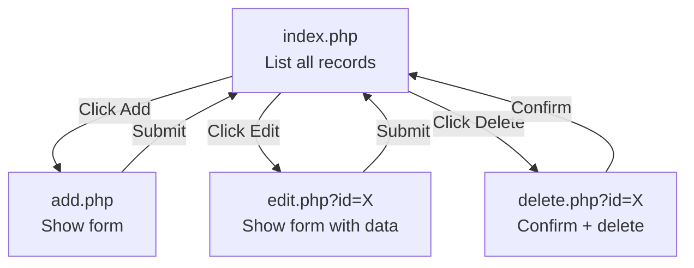

# Week 1 — Sunday Lecture: PHP + MySQL: Running Queries & HTML Forms

**IM102 – Advanced Database Systems**  
**St. Peter's College – College of Computer Studies**  
**Room: Lecture Room (No PCs — paper-based discussion)**

---

## Intended Learning Outcomes

At the end of this session, students should be able to:
1. Write PHP code on paper that connects to MySQL
2. Trace how `fetch_assoc()` loops through result rows
3. Write PHP form handlers that insert data into MySQL
4. Explain the difference between GET and POST
5. Diagram the CRUD page flow

---

## Part 1: Connecting PHP to MySQL (1.5 hrs)

### The Connection Script

Every PHP project starts with a connection file:

```php
<?php
// config.php
$host = 'localhost';    // Server address
$user = 'root';         // MySQL username
$pass = '';             // MySQL password (empty by default in XAMPP)
$db   = 'im102_db';     // Database name

$conn = new mysqli($host, $user, $pass, $db);

// Check for errors
if ($conn->connect_error) {
    die("Connection failed: " . $conn->connect_error);
}

// Set character encoding
$conn->set_charset("utf8mb4");
?>
```

**Why a separate config.php?** Include it once with `require_once 'config.php'` at the top of every page. If your database password changes, you update only one file.

### Three Ways to Include Files

| Command | Behavior |
|---------|----------|
| `include 'file.php'` | Includes file, warning if missing |
| `require 'file.php'` | Includes file, **fatal error** if missing |
| `require_once 'file.php'` | Includes file **only once** — safest for config |

> Always use `require_once` for `config.php`.

### 🖐 Participation 1 — Paper: Fix the Connection (Individual)

This connection has 2 errors. Write the corrected version:

```php
$conn = new mysqli('localhost', 'root', 'im102_db');
if ($conn->connect_error) {
    echo "Failed";
}
```

*Hint: missing parameter, and error handling should stop execution.*

---

## Part 2: Running SELECT Queries (1.5 hrs)

### Step by Step

```php
<?php
require_once 'config.php';

// Step 1: Write the SQL
$sql = "SELECT id, name, email FROM users";

// Step 2: Execute
$result = $conn->query($sql);

// Step 3: Check if we got rows
if ($result->num_rows > 0) {
    // Step 4: Loop through each row
    while ($row = $result->fetch_assoc()) {
        echo $row['name'] . " - " . $row['email'] . "<br>";
    }
} else {
    echo "No users found.";
}
?>
```

### Key Functions to Memorize

| Function | Returns |
|----------|---------|
| `$conn->query($sql)` | Result object (or FALSE on error) |
| `$result->num_rows` | Integer — how many rows |
| `$result->fetch_assoc()` | Next row as array, or NULL when done |

### How fetch_assoc() Works

Imagine a table with 3 rows:

| id | name | email |
|----|------|-------|
| 1 | Juan | juan@mail.com |
| 2 | Maria | maria@mail.com |
| 3 | Pedro | pedro@mail.com |

```php
while ($row = $result->fetch_assoc()) {
    // Loop 1: $row = ['id'=>1, 'name'=>'Juan', 'email'=>'juan@mail.com']
    // Loop 2: $row = ['id'=>2, 'name'=>'Maria', 'email'=>'maria@mail.com']
    // Loop 3: $row = ['id'=>3, 'name'=>'Pedro', 'email'=>'pedro@mail.com']
}
```

After the 3rd row, `fetch_assoc()` returns `NULL` and the loop stops.

### Display in an HTML Table

```php
<table border="1">
    <tr><th>ID</th><th>Name</th><th>Email</th></tr>
    <?php while ($row = $result->fetch_assoc()): ?>
    <tr>
        <td><?= $row['id'] ?></td>
        <td><?= $row['name'] ?></td>
        <td><?= $row['email'] ?></td>
    </tr>
    <?php endwhile; ?>
</table>
```

`<?= $var ?>` is shorthand for `<?php echo $var; ?>`

### 🖐 Participation 2 — Paper: Trace the Output (Individual)

Given this `users` table:

| id | username | role |
|----|----------|------|
| 1 | admin | admin |
| 2 | juan | user |
| 3 | maria | user |

What does this code output?

```php
$result = $conn->query("SELECT * FROM users WHERE role = 'user'");
while ($row = $result->fetch_assoc()) {
    echo $row['username'] . ",";
}
```

*Write the exact output on 1/4 sheet.*

---

## Part 3: Inserting Data from Forms (1.5 hrs)

### How HTML Forms Send Data

```html
<form method="POST" action="save.php">
    <input type="text" name="username" placeholder="Username">
    <input type="email" name="email" placeholder="Email">
    <button type="submit">Register</button>
</form>
```

When submitted, PHP receives:

```php
$_POST['username']  // whatever the user typed
$_POST['email']     // whatever the user typed
```

### The Handler Script

```php
<?php
// save.php
require_once 'config.php';

if ($_SERVER['REQUEST_METHOD'] === 'POST') {
    $username = $_POST['username'];
    $email = $_POST['email'];
    
    // Basic check
    if (!empty($username) && !empty($email)) {
        $sql = "INSERT INTO users (username, email) VALUES ('$username', '$email')";
        $conn->query($sql);
        echo "Saved! <a href='index.php'>View all</a>";
    } else {
        echo "Please fill all fields.";
    }
}
?>
```

### GET vs POST

| | GET | POST |
|---|-----|------|
| **Data location** | In the URL (visible) | In the request body (hidden) |
| **Bookmarkable?** | Yes | No |
| **Length limit** | ~2000 chars | No practical limit |
| **Use for** | Search, filters, links | Login, registration, forms that change data |

```
GET:  http://localhost/search.php?keyword=laptop&category=electronics
POST: http://localhost/save.php    (data hidden in request body)
```

### Redirect After Insert

After saving data, **always redirect** to prevent duplicate submissions:

```php
$conn->query($sql);
header('Location: index.php');
exit;  // Always call exit after header redirect
```

### 🖐 Participation 3 — Paper: Write a Form Handler (Individual)

Write the complete PHP code for a page that:
1. Checks if the request method is POST
2. Gets `$_POST['title']` and `$_POST['content']`
3. Inserts them into a `posts` table using `INSERT INTO`
4. Redirects to `index.php` on success

*Write on 1/4 sheet. Pass after 7 minutes.*

---

## Part 4: The Complete CRUD System (30 min)

Every database system needs four pages:

| Page | URL | SQL | Method |
|------|-----|-----|--------|
| **List** | `index.php` | `SELECT * FROM table` | GET |
| **Add** | `add.php` | `INSERT INTO table VALUES (...)` | POST |
| **Edit** | `edit.php?id=5` | `UPDATE table SET ... WHERE id=5` | POST |
| **Delete** | `delete.php?id=5` | `DELETE FROM table WHERE id=5` | POST |

### Page Flow Diagram



This week in the lab, you will build all four pages for a student management system.

---

## 📝 Quiz (10 items, 20 points — 1/4 sheet)

1. Write the PHP code to connect to a MySQL database named `school`.
2. What function executes a SQL query?
3. What does `$result->num_rows` tell you?
4. What does `$result->fetch_assoc()` return?
5. Write the loop that goes through all rows of a result set.
6. Where does form data sent via POST go?
7. What is `$_SERVER['REQUEST_METHOD']` used for?
8. Why should you redirect after a successful INSERT?
9. Write the SQL to update a user's email to `'new@mail.com'` where id = 3.
10. Write the SQL to delete a student where id = 7.

---

## 📋 Assignment (Do before Monday Lab)

1. Review yesterday's SQL and PHP basics
2. On paper, draw the CRUD page flow diagram for a "Product Management" system
3. Write the SQL `CREATE TABLE` for a `products` table with: id, name, price, description, stock, created_at
4. Write the `INSERT` statement for 3 sample products
5. Write the `SELECT` statement that shows all products sorted by price (cheapest first)

**Bring your paper answers to Monday's lab — we'll use them as reference when you code.**
